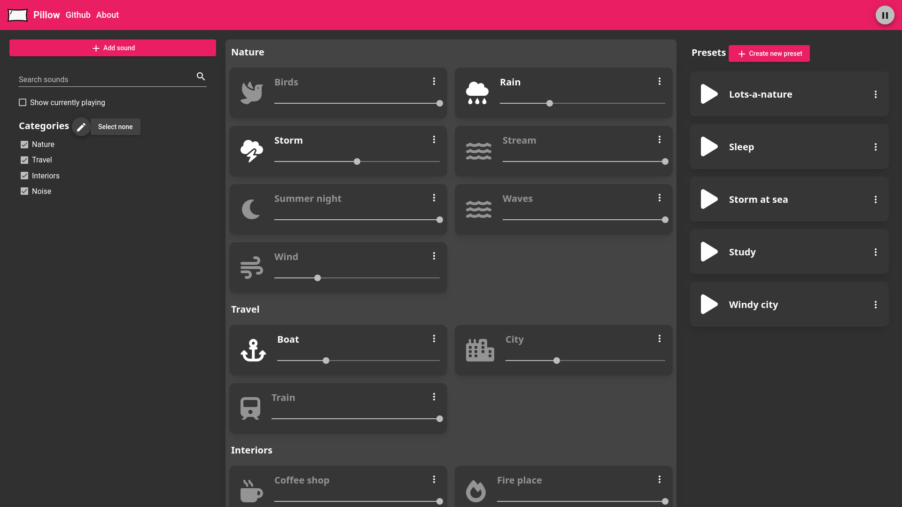

# GUI project - Pillow

## Live demo

https://pillow-c3b4c.web.app/

## Running the project

`npm i`  
`ng serve`

## Running the db

`json-server --watch db.json`

## What is Pillow?

Pillow is a project for my subject GUI development.  
Pillow is heavily inspired by [Blanket](https://github.com/rafaelmardojai/blanket). Pillow sets out to be web driven and allow for more customizability in terms of custom sounds and presets.  
Presets and filters easy to use and access.

  
*Main screen interface of Pillow*

*Responsive variation of the main interface*

  
*Edit categories*

## Requirements

We were allowed to continue working on our project but have to fulfil the following requirements:
Angular: 
- [X] Authentication module
    - [X] Service
    - [X] Log in, out and register
    - [X] Registration form is reactive
        - [X] Asynchronous validator
        - Clear messages and visual hints when not filled in correctly
    - [X] use firebase sdk for auth
    - [X] No email verification!*
- [X] Lazy loaded module
- [X] Data/backed service
- [X] Routes
    - 3 different routes
    - 1 child route (does admin count?)
    - catch incorrect routes
- [X] Routing guards
    - [X] 2 canActivate
        - canLoad for Admin counts :)
    - [X] 1 canDeactive
- [X] Custom made directive
- [X] 1 pipe to sort/filter
- [X] 3 access levels
    - Not logged in => restricted access (login/registration)
    - Logged in => use of app for normal user
    - Admin => more options
- [ ] unit testing plan as complete as possible 1 component (negative and positive tests)
- [ ] out of resting plan write 3 pos and 2 neg unit tests for that component
- [X] Deploy app via firebase

Firebase:
- [X] Database access with fire base sdk
- [X] Database rules for admin and user
- [X] use email and pass auth firebase sdk
- [X] storage for docs, figures ...
- [X] hosting app on firebase

Doc:
- [X] readme with firebase URL
- [ ] testing plan for component of choice
- [ ] test results
- [X] full code without node modules

*For quick testing and fake accounts
