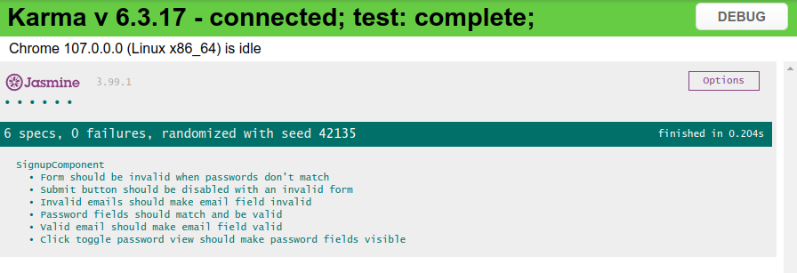

# Testing results

```
❯ ng test
✔ Browser application bundle generation complete.
Chrome 107.0.0.0 (Linux x86_64): Executed 6 of 6 SUCCESS (0.187 secs / 0.173 secs)
TOTAL: 6 SUCCESS
```



## Positive tests

### Password fields should match and be valid

This test will try all the values of `validPasswords`, set their values in both
password fields and then check if the form contains an error.  
In `validPasswords` we also test the edge case of the minimum length requirement.  
Namely exactly a length of 8 and longer.

All these values passed.

### Click toggle password view should make password fields visible

The page starts with the password fields hidden, thus clicking the toggle button
once should make the fields visible.
I test this by querying the first button, which is the toggle button, clicking it,
and then checking if the attributes of both password fields are indeed `text`.

This test passed.

### Valid email should make email field valid

This fake async test will make use of the mock auth service.
Valid email addresses (valid and also not in use) will be looped over,
entered in the email field and checked for vadility.
Afterwards we check if the field is actually valid.

## Negative tests

### Form should be invalid when passwords don't match

We enter a value in the password field and a different value in the confirm
password field.

We then expect the form to have the nomatch error.

This test passed.

### Submit button should be disabled with an invalid form

By default the form is invalid, we then check if the button with type submit
has the attribute disabled set to true.

This test passed.

### Invalid emails should make email field invalid

Here we combine used emails and invalid emails and go over every email.
We enter the email in the field, update their validity and then check if the 
email field is invalid.  
We expect all the values to make the email field invalid.

All these values passed.

